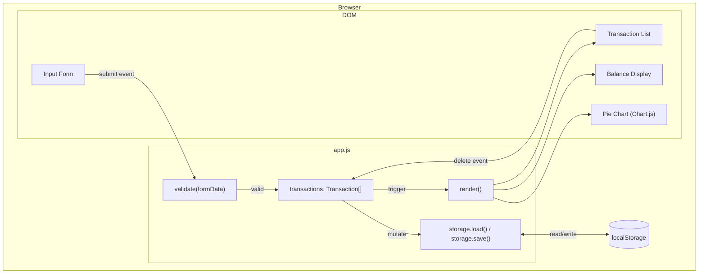

# Design Document: Expense Tracker

## Overview

The Expense Tracker is a single-page web application built with HTML, CSS, and Vanilla JavaScript. It runs entirely in the browser with no backend — all state is held in memory and persisted to the browser's `localStorage` API. The app lets users log named expenses with an amount and category, view a running total balance, browse a scrollable transaction list, and visualize spending by category via a Chart.js pie chart.

The architecture follows a simple **data → render** pattern: a single in-memory array of transactions is the source of truth. Every user action (add, delete, init) mutates that array, persists it to `localStorage`, and then triggers a full re-render of all three UI regions (balance, list, chart). This keeps the data flow predictable and easy to reason about without a framework.

**Key technology choices:**
- **Chart.js 4.5.0** (via CDN) for the pie chart — it is the most widely used, well-documented charting library for vanilla JS and requires no build step.
- **`localStorage`** for persistence — synchronous, universally supported in modern browsers, and sufficient for the data volumes of a personal tracker.
- No build tools, no bundler, no dependencies beyond Chart.js.

---

## Architecture

The app is delivered as a single HTML file (`index.html`) that loads one CSS file (`style.css`) and one JavaScript module (`app.js`). All logic lives in `app.js`.



**Data flow on add:**
1. User submits form → `handleAdd()` is called
2. `validate()` checks fields → returns errors or null
3. On success: new `Transaction` is pushed to `transactions[]`
4. `storage.save(transactions)` writes to `localStorage`
5. `render()` updates Balance, List, and Chart

**Data flow on delete:**
1. User clicks delete button → `handleDelete(id)` is called
2. Transaction is filtered out of `transactions[]`
3. `storage.save(transactions)` writes to `localStorage`
4. `render()` updates Balance, List, and Chart

**Data flow on init:**
1. `DOMContentLoaded` fires → `init()` is called
2. `storage.load()` reads from `localStorage`
3. `transactions[]` is populated (or stays empty)
4. `render()` draws the initial UI

---

## Components and Interfaces

### `Transaction` (data object)

```js
{
  id: string,        // crypto.randomUUID() — unique identifier
  name: string,      // item name, non-empty
  amount: number,    // positive number
  category: string   // "Food" | "Transport" | "Fun"
}
```

### `validate(formData)` → `ValidationResult`

Pure function. Takes raw form field values and returns either `null` (valid) or an object describing which fields failed.

```js
// Input
formData = { name: string, amount: string, category: string }

// Output — null means valid
ValidationResult = null | {
  name?: string,    // error message if name is invalid
  amount?: string,  // error message if amount is invalid
  category?: string // error message if category is invalid
}
```

Validation rules:
- `name`: must be non-empty after trimming whitespace
- `amount`: must parse to a finite number greater than 0
- `category`: must be one of `"Food"`, `"Transport"`, `"Fun"`

### `storage` (module)

```js
storage.save(transactions: Transaction[]): void
// Serializes transactions to JSON and writes to localStorage key "expense-tracker-transactions"

storage.load(): Transaction[]
// Reads from localStorage, parses JSON, returns array (or [] if missing/corrupt)
```

### `render()` (function)

Reads the current `transactions[]` array and updates all three UI regions:

```js
render(): void
// 1. renderBalance(transactions)
// 2. renderList(transactions)
// 3. renderChart(transactions)
```

Each sub-renderer is a pure function of the transactions array.

### `renderBalance(transactions)` → void

Computes `sum = transactions.reduce((acc, t) => acc + t.amount, 0)` and sets the text content of the balance element.

### `renderList(transactions)` → void

Clears the list container and rebuilds it from the transactions array in reverse order (most recent first). Each item is an `<li>` containing the name, amount, category, and a delete `<button>` with `data-id` attribute.

### `renderChart(transactions)` → void

Aggregates amounts by category. If no transactions exist, destroys the chart instance and shows a placeholder message. Otherwise, updates (or creates) the Chart.js pie chart instance with the aggregated data.

### `handleAdd(event)` → void

Form submit handler. Calls `validate()`, displays errors if invalid, or creates a new `Transaction`, updates state, persists, and re-renders.

### `handleDelete(id)` → void

Delete button click handler. Filters the transaction out of the array, persists, and re-renders.

### `init()` → void

Called on `DOMContentLoaded`. Loads from storage, sets up event listeners, and calls `render()`.

---

## Data Models

### Transaction

| Field      | Type   | Constraints                          |
|------------|--------|--------------------------------------|
| `id`       | string | UUID, generated at creation time     |
| `name`     | string | Non-empty after trim                 |
| `amount`   | number | Finite, > 0                          |
| `category` | string | One of: `"Food"`, `"Transport"`, `"Fun"` |

### localStorage Schema

- **Key**: `"expense-tracker-transactions"`
- **Value**: JSON-serialized `Transaction[]`
- **On corrupt/missing**: treated as `[]`

### Chart Data Shape (passed to Chart.js)

```js
{
  labels: string[],          // e.g. ["Food", "Transport"]
  datasets: [{
    data: number[],           // sum of amounts per category, same order as labels
    backgroundColor: string[] // fixed color per category
  }]
}
```

### Category Color Map

| Category    | Color     |
|-------------|-----------|
| Food        | `#FF6384` |
| Transport   | `#36A2EB` |
| Fun         | `#FFCE56` |

---

## Correctness Properties

*A property is a characteristic or behavior that should hold true across all valid executions of a system — essentially, a formal statement about what the system should do. Properties serve as the bridge between human-readable specifications and machine-verifiable correctness guarantees.*

### Property 1: Validator rejects all invalid inputs

*For any* combination of form field values where the name is empty or whitespace-only, the amount is non-positive, zero, NaN, or non-numeric, or the category is not one of the valid options, the `validate()` function SHALL return a non-null result indicating the failing field(s).

**Validates: Requirements 1.2, 1.3**

---

### Property 2: Valid transaction add round-trip

*For any* valid transaction (non-empty name, positive amount, valid category), after calling `handleAdd()`, the transaction SHALL appear in the `transactions[]` array, be rendered in the Transaction_List DOM, and be present in the data written to `localStorage`.

**Validates: Requirements 1.4, 2.1, 3.1**

---

### Property 3: Form resets after valid submission

*For any* valid transaction submission, after `handleAdd()` completes, all form fields (name, amount, category) SHALL be reset to their default empty/unselected state.

**Validates: Requirements 1.5**

---

### Property 4: Transaction list is in reverse-insertion order

*For any* sequence of transactions added to the app, the Transaction_List SHALL render them in reverse order of insertion — the most recently added transaction SHALL appear first.

**Validates: Requirements 3.3**

---

### Property 5: Every list item has a delete control

*For any* non-empty `transactions[]` array, every rendered list item in the Transaction_List SHALL contain a delete control element with a `data-id` attribute matching the transaction's `id`.

**Validates: Requirements 4.1**

---

### Property 6: Delete removes transaction from list and storage

*For any* transaction currently in `transactions[]`, after calling `handleDelete(id)`, that transaction SHALL no longer appear in `transactions[]`, SHALL no longer be rendered in the Transaction_List, and SHALL no longer be present in the data stored in `localStorage`.

**Validates: Requirements 4.2, 2.2**

---

### Property 7: Balance always equals sum of transaction amounts

*For any* state of `transactions[]` (including empty), the value displayed in the Balance_Display SHALL equal the arithmetic sum of all `amount` fields in the array. When the array is empty, the displayed value SHALL be 0.

**Validates: Requirements 5.2, 5.3, 5.4, 5.5, 4.3**

---

### Property 8: Chart data matches category sums

*For any* non-empty `transactions[]`, the data passed to the Chart.js instance SHALL contain exactly one entry per category that has at least one transaction, and each entry's value SHALL equal the sum of `amount` fields for transactions in that category.

**Validates: Requirements 6.1, 4.4, 6.3, 6.4**

---

### Property 9: App initializes from localStorage

*For any* array of valid transactions previously written to `localStorage`, calling `init()` SHALL populate `transactions[]` with those transactions and render them in the Transaction_List, Balance_Display, and Chart.

**Validates: Requirements 2.3, 2.4**

---

## Error Handling

### Validation Errors (user input)

- Handled inline: `validate()` returns a `ValidationResult` object describing each failing field.
- The form renders error messages adjacent to the relevant field.
- No transaction is created; the form retains its current values so the user can correct them.

### localStorage Errors

- **Corrupt data**: `storage.load()` wraps `JSON.parse` in a try/catch. On any parse error, it returns `[]` and the app starts fresh.
- **Storage quota exceeded**: `storage.save()` wraps `localStorage.setItem` in a try/catch. On `QuotaExceededError`, a non-blocking warning is logged to the console. The in-memory state remains correct; only persistence fails.
- **`localStorage` unavailable** (e.g., private browsing in some browsers): `storage.load()` and `storage.save()` catch the access error and degrade gracefully — the app functions in-memory only for the session.

### Chart.js Errors

- If Chart.js fails to load from CDN, the chart canvas area shows a static fallback message ("Chart unavailable — please check your connection").
- The rest of the app (form, list, balance) continues to function normally.

### Empty State

- Empty transaction list: Balance shows `$0.00`, list shows a "No transactions yet" placeholder, chart shows a "No data available" placeholder.

---

## Testing Strategy

### Overview

This feature is a vanilla JS web app with pure business logic functions (`validate`, `renderBalance`, `renderChart`, `storage.load/save`) that are well-suited to property-based testing. UI rendering functions are tested with example-based DOM tests.

**Property-based testing library**: [fast-check](https://fast-check.dev/) (JavaScript, no build step required, can run in Node.js with jsdom).

### Unit Tests (example-based)

Focus on specific scenarios and edge cases:

- `validate()` with all-valid input returns `null`
- `validate()` with empty name returns error for name field
- `validate()` with zero amount returns error for amount field
- `validate()` with negative amount returns error for amount field
- `validate()` with invalid category returns error for category field
- `storage.load()` returns `[]` when localStorage is empty
- `storage.load()` returns `[]` when localStorage contains corrupt JSON
- `renderBalance()` displays `$0.00` for empty array
- Chart shows placeholder when transactions array is empty
- Form fields are present in the DOM on load

### Property-Based Tests

Each property test runs a minimum of **100 iterations**.

Tag format: `Feature: expense-tracker, Property {N}: {property_text}`

**Property 1 — Validator rejects all invalid inputs**
- Generator: arbitrary combinations of (name, amount, category) where at least one field is invalid (empty/whitespace name, non-positive amount, invalid category)
- Assert: `validate(formData) !== null`
- Tag: `Feature: expense-tracker, Property 1: Validator rejects all invalid inputs`

**Property 2 — Valid transaction add round-trip**
- Generator: arbitrary valid (name, amount, category) tuples
- Assert: after `handleAdd()`, transaction appears in `transactions[]`, in DOM list, and in `storage.load()`
- Tag: `Feature: expense-tracker, Property 2: Valid transaction add round-trip`

**Property 3 — Form resets after valid submission**
- Generator: arbitrary valid transaction inputs
- Assert: after `handleAdd()`, all form field values are empty/default
- Tag: `Feature: expense-tracker, Property 3: Form resets after valid submission`

**Property 4 — Transaction list is in reverse-insertion order**
- Generator: arbitrary sequences of 1–20 valid transactions
- Assert: rendered list items appear in reverse order of insertion
- Tag: `Feature: expense-tracker, Property 4: Transaction list is in reverse-insertion order`

**Property 5 — Every list item has a delete control**
- Generator: arbitrary non-empty arrays of valid transactions
- Assert: every rendered `<li>` contains a `[data-id]` delete button
- Tag: `Feature: expense-tracker, Property 5: Every list item has a delete control`

**Property 6 — Delete removes transaction from list and storage**
- Generator: arbitrary non-empty transaction arrays; pick a random transaction to delete
- Assert: after `handleDelete(id)`, transaction absent from `transactions[]`, DOM, and `storage.load()`
- Tag: `Feature: expense-tracker, Property 6: Delete removes transaction from list and storage`

**Property 7 — Balance always equals sum of transaction amounts**
- Generator: arbitrary arrays of valid transactions (including empty array)
- Assert: displayed balance text equals `transactions.reduce((s, t) => s + t.amount, 0)`
- Tag: `Feature: expense-tracker, Property 7: Balance always equals sum of transaction amounts`

**Property 8 — Chart data matches category sums**
- Generator: arbitrary non-empty arrays of valid transactions
- Assert: chart dataset values match `sum(amount)` grouped by category; labels match only categories present
- Tag: `Feature: expense-tracker, Property 8: Chart data matches category sums`

**Property 9 — App initializes from localStorage**
- Generator: arbitrary arrays of valid transactions pre-seeded into localStorage
- Assert: after `init()`, `transactions[]` matches seeded data and all items are rendered
- Tag: `Feature: expense-tracker, Property 9: App initializes from localStorage`

### Integration / Smoke Tests

- App loads without JS errors in Chrome, Firefox, Edge, Safari (manual)
- Balance, list, and chart all render correctly on first load with pre-existing localStorage data (manual)
- App works when opened as `file://` (manual)
